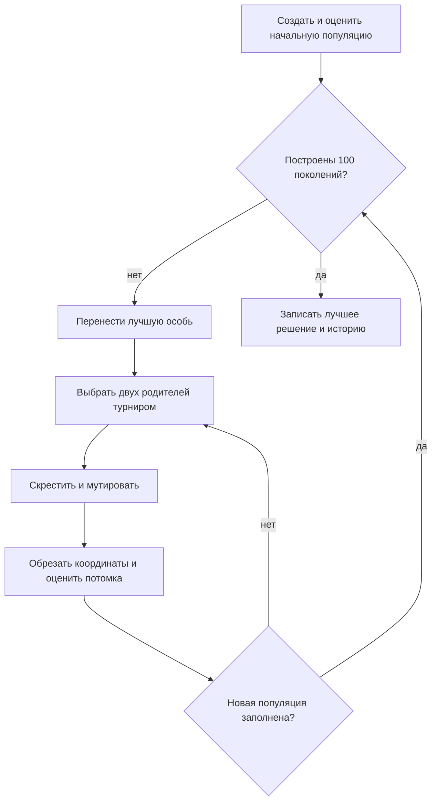
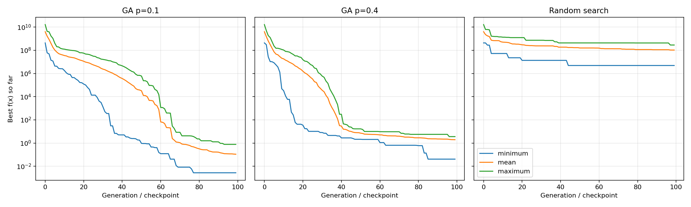

# Лабораторная работа № 1

**Многомерная оптимизация сложной функции генетическим алгоритмом**

- Дисциплина: «Эволюционное программирование и генетические алгоритмы».
- Выполнил: **Сухарев Фёдор Дмитриевич**, группа 527, номер в списке 23.
- Вариант \(V = 12\), размерность \(d = 5\).
- Язык реализации: Python 3. Для графика используется Matplotlib; готовые оптимизаторы не используются.

## 1. Постановка задачи и вариант

Для группы 527 индекс \(Q = 2\), номер в группе \(N = 23\), год выполнения \(Y = 26\). По формуле из методички:

\[
V = 1 + ((17N + 7Q + Y) \bmod 20)
  = 1 + ((17\cdot23 + 7\cdot2 + 26) \bmod 20)
  = 1 + (431 \bmod 20) = 12.
\]

\[
d = 5 + (V \bmod 6) = 5.
\]

Нужно найти приближённый минимум функции Цин:

\[
\min_{x\in D} f_{12}(x),\qquad
f_{12}(x)=\sum_{i=1}^{5}(x_i^2-i)^2,\qquad
D=[-500,500]^5.
\]

Каждое слагаемое является квадратом, поэтому \(f_{12}(x)\geq 0\). Глобальный минимум равен нулю и достигается, когда \(x_i=\pm\sqrt{i}\). Знаки можно выбирать независимо, то есть глобальных минимумов 32. Например, один из них — \((1,\sqrt2,\sqrt3,2,\sqrt5)\).

## 2. Пространство решений, цель и ограничения

- Пространство поиска — все вещественные векторы из пяти координат в кубе \([-500,500]^5\).
- Фитнесом служит сама целевая функция: чем меньше \(f_{12}(x)\), тем лучше особь.
- Ограничения только координатные. После мутации значения меньше \(-500\) заменяются на \(-500\), а значения больше \(500\) — на \(500\). Начальная популяция сразу создаётся внутри куба.

## 3. Представление особи

Особь — список из пяти чисел `float`: `[x1, x2, x3, x4, x5]`. Генотип совпадает с решением задачи, поэтому отдельного декодирования нет. Каждая координата начальной особи выбирается независимо и равномерно на \([-500,500]\).

## 4. Алгоритм и операторы

Используется поколенческий генетический алгоритм с сохранением одной лучшей особи.



| Параметр | Значение |
| --- | --- |
| Размер популяции | 60 |
| Число поколений | 100, включая начальное |
| Селекция | турнир из 3 разных особей |
| Скрещивание | равномерное по координатам, вероятность 0,9 |
| Мутация | добавка из \(N(0,\sigma^2)\) к каждой координате с вероятностью \(p\) |
| Масштаб мутации | постоянный шаг \(\sigma=5\) |
| Обработка границ | обрезка до \([-500,500]\) |
| Элитизм | 1 лучшая особь без повторной оценки |
| Остановка | после 100 поколений |
| Бюджет вычислений функции | \(60+99\cdot59=5901\) на запуск |
| Seeds | 2026–2045 включительно |

**Селекция.** В турнире случайно выбираются три разные особи, родителем становится лучшая из них. Это удобно при большом разбросе значений функции: не требуется переводить значение \(f\) в вероятность выбора.

**Скрещивание.** С вероятностью 0,9 создаётся потомок, у которого каждая координата случайно взята у первого или второго родителя. Если скрещивания нет, копируется первый родитель. Здесь это разумно, поскольку \(f_{12}\) является суммой независимых слагаемых: удачные значения разных координат можно собрать в одном векторе.

**Мутация.** Каждая координата независимо меняется с вероятностью \(p\). К ней прибавляется случайное число из нормального распределения \(N(0,5^2)\). Шаг 5 выбран постоянным для всех поколений. Для сравнения взяты две конфигурации: **\(p=0.1\)** и **\(p=0.4\)**. Все остальные параметры одинаковы.

**Элитизм и бюджет.** Лучшая особь переносится в следующее поколение без изменения и без нового вызова \(f\). Поэтому при 60 особях в начальном поколении и 59 новых потомках в каждом из следующих 99 поколений получается ровно 5901 вычисление функции. История хранит лучшее значение, достигнутое к концу каждого поколения.

## 5. Почему задача сложна для простого поиска

При равномерной случайной выборке нужно одновременно получить пять координат возле \(\pm\sqrt{i}\), хотя каждая выбирается из интервала длиной 1000. Поэтому даже несколько тысяч случайных точек обычно оказываются далеко от минимума.

Для градиентного спуска производная отдельного слагаемого равна \(4x_i(x_i^2-i)\). Вдали от минимума она очень велика, а около \(x_i=0\) мала. Метод с одним постоянным шагом для всего куба может вести себя плохо. При этом функция разделяется по координатам и не имеет неглобальных локальных минимумов. Метод спуска с подходящим выбором шага мог бы решить её успешно; в этой работе он не сравнивался с ГА.

## 6. Эксперименты

Проведены три серии по 20 независимых запусков:

1. ГА с вероятностью мутации \(p=0.1\);
2. ГА с вероятностью мутации \(p=0.4\);
3. равномерный случайный поиск.

Для всех серий используются seeds от 2026 до 2045 и одинаковый бюджет 5901 вычисление функции на запуск. При одинаковом seed начальные 60 точек у трёх методов совпадают. Различаются только последующие действия. Исходные данные по каждому запуску записаны в [runs.csv](results/runs.csv), траектории — в [history.csv](results/history.csv).

### 6.1. Итоговые значения

Статистика подсчитана по лучшему значению \(f\) в конце каждого запуска. Стандартное отклонение — выборочное (деление на \(n-1\)). Меньше — лучше.

| Метод | Лучшее | Среднее | Медиана | Ст. откл. | Худшее |
| --- | ---: | ---: | ---: | ---: | ---: |
| ГА, \(p=0.1\) | 0,00271834 | 0,108723 | 0,0633283 | 0,170116 | 0,767152 |
| ГА, \(p=0.4\) | 0,0409286 | 1,94765 | 2,04875 | 1,00097 | 3,59361 |
| Случайный поиск | 4,92034·10⁶ | 1,05635·10⁸ | 6,58544·10⁷ | 8,70021·10⁷ | 2,88043·10⁸ |

Лучший запуск первой конфигурации — seed 2031:

\[
x\approx(0.979087,\ 1.407402,\ 1.733261,\ -1.999398,\ -2.241596),
\qquad f(x)\approx0.00271834.
\]

Это близко к одному из точных минимумов \((1,\sqrt2,\sqrt3,-2,-\sqrt5)\). При \(p=0.1\) все 20 запусков дали \(f<1\), из них 15 — \(f<0.1\). При \(p=0.4\) порога \(f<1\) достигли 4 запуска. Случайный поиск не достиг этого порога ни разу.

### 6.2. Сходимость



На графике показаны минимум, среднее и максимум лучшего найденного значения по серии. Для случайного поиска вместо поколения используется контрольная точка после такого же числа вычислений функции. Вертикальная ось логарифмическая: стартовые значения и конечные результаты различаются на много порядков.

Оба варианта ГА быстро снижают \(f\) в начале. После этого улучшения становятся реже: особенно заметно плато у варианта \(p=0.4\). У случайной выборки улучшения редкие, а финальные значения остаются порядка миллионов и выше.

### 6.3. Влияние вероятности мутации

Менялся только параметр \(p\). При \(p=0.1\) среднее итоговое значение составило 0,109, при \(p=0.4\) — 1,948. Разница примерно в 18 раз. При большой вероятности чаще меняются уже хорошие координаты. Элитизм не даёт потерять лучший результат, но уточнение идёт медленнее. Этот вывод относится к выбранным настройкам и 20 запускам, а не ко всем возможным значениям \(p\).

## 7. Оценка качества результата

Теоретический минимум равен нулю. Все 20 запусков ГА с \(p=0.1\) дали \(f<1\), а лучший — около 0,0027. Координаты лучшего решения близки к аналитическому минимуму. Для учебного ГА с простым постоянным шагом и заданным бюджетом результат приемлемый. Он менее точный, чем при уменьшении шага мутации к концу поиска: постоянный шаг 5 мешает тонкой настройке около минимума.

Эксперимент показывает преимущество ГА над равномерной случайной выборкой на данной задаче. Он не доказывает преимущество над методами с использованием производных. Также проверялись только две вероятности мутации при одном размере популяции и одном бюджете. ГА является случайным методом и строгой гарантии получения ровно \(f=0\) за 5901 вычисление не даёт.

## 8. Воспроизведение

Из каталога `lab1`:

```bash
python -m pip install -r requirements.txt
python -m unittest discover -s . -p "test_*.py"
python main.py
```

Параметры записаны в [config.json](config.json). Повторный запуск с теми же параметрами создаёт те же CSV, статистику и график в папке `results`. Описание файлов приведено в [README.md](README.md).
